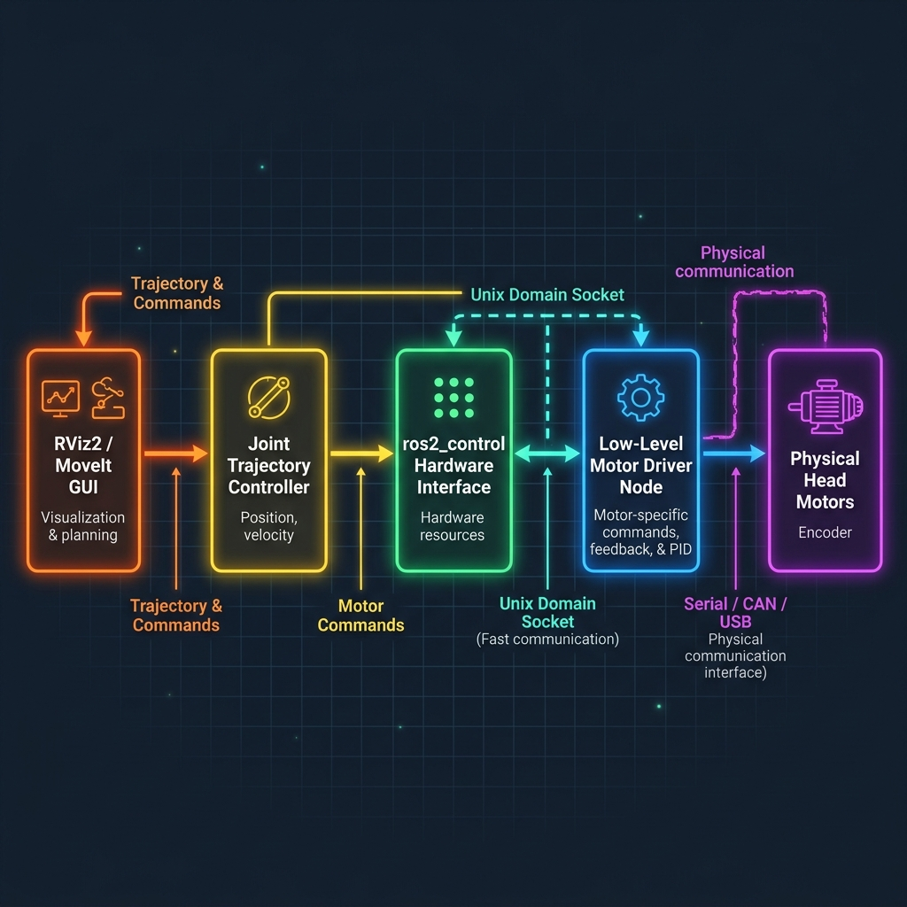

# Specification: Head Motor Low-Level Driver (Option B — Process Separation via UDS)

This document specifies the interface and requirements for the **Low-Level Head Motor Driver**
(implemented by the teammate) and how it communicates with the
**High-Level `ros2_control` Hardware Interface** (implemented by the team lead).

> [!IMPORTANT]
> Both sides must follow this spec exactly. Any deviation in message format, framing, or
> startup order will cause the integration to fail silently or crash at runtime.

---

## 1. Overview of the Control Loop

When the operator commands the robot (e.g., using **RViz2** or a Behavior Tree sequence):

1. **RViz2 / MoveIt** sends trajectory commands to the high-level ROS 2 controllers.
2. The **Joint Trajectory Controller** decomposes these into per-joint position targets.
3. The **`ros2_control` Hardware Interface** (`openarm_hardware`) calls `write()` at each control tick and sends target angles over a local **Unix Domain Socket (UDS)** to the Low-Level Driver.
4. The **Low-Level Driver** translates angles into raw motor commands (Serial/TTL, CAN-bus, Dynamixel, etc.) and sends them to the physical motors.
5. In reverse, the driver reads encoder states and pushes them back over the socket so the Hardware Interface's `read()` populates ROS 2 joint states — allowing RViz2 to visualize the real robot.



---

## 2. Communication Channel: Unix Domain Socket (UDS)

| Property | Value |
|---|---|
| **Socket path** | `/tmp/openarm_head_motor.sock` |
| **Type** | `SOCK_STREAM` (reliable, ordered byte stream) |
| **Framing** | Newline-delimited JSON (NDJSON): each message is one JSON object followed by exactly one `\n` byte. The sender **must** flush after every `\n`. |
| **Encoding** | UTF-8 |

> [!WARNING]
> `SOCK_STREAM` does **not** preserve message boundaries. Parsers on both sides must buffer
> incoming bytes and split on `\n` before parsing JSON. Never assume one `recv()` call equals
> one complete message.

---

## 3. Startup & Reconnection Protocol

### Who Binds, Who Connects
- **The Low-Level Driver** (teammate) is the **server** — it creates and binds to the socket path on startup.
- **The Hardware Interface** (team lead) is the **client** — it connects to the socket in its `on_activate()` callback.

### Startup Order
```
1. Start the Low-Level Driver node first.
2. Start ros2_control (robot launch). The Hardware Interface will retry connecting.
```

### Hardware Interface Retry Policy (Team Lead implements this)
- On `on_activate()`, attempt to connect to `/tmp/openarm_head_motor.sock`.
- If connection fails, retry every **500ms** for up to **10 seconds** total.
- If still not connected after 10 s, return `CallbackReturn::FAILURE` (the controller manager will log an error and not activate).
- Log each retry attempt at `WARN` level.

### Driver Restart / Reconnection
- If the Hardware Interface detects the socket is broken (read/write returns error), it must:
  1. Mark internal state as `DISCONNECTED`.
  2. Freeze the last known joint positions (do not extrapolate).
  3. Begin the retry loop above automatically — **without** restarting `ros2_control`.
- The Low-Level Driver must **delete the old socket file** and re-create it on restart so the Hardware Interface can reconnect cleanly.

---

## 4. Message Contracts

### A. State Message — Driver → Hardware Interface
Sent by the driver at a fixed **100 Hz** rate. The driver sends this regardless of whether a command has been received.

```json
{
  "type": "state",
  "seq": 1024,
  "timestamp": 1718012345.678,
  "pan_pos": 0.0,
  "tilt_pos": 0.0,
  "pan_vel": 0.0,
  "tilt_vel": 0.0,
  "pan_load": 0.0,
  "tilt_load": 0.0,
  "is_healthy": true,
  "error_code": 0,
  "error_msg": ""
}
```

| Field | Type | Unit | Description |
|---|---|---|---|
| `type` | `string` | — | Always `"state"` |
| `seq` | `uint32` | — | Monotonically increasing counter. Hardware Interface uses this to detect dropped messages. |
| `timestamp` | `float64` | seconds (Unix) | Time the encoder was sampled. |
| `pan_pos` | `float64` | **Radians** | Current pan joint position. |
| `tilt_pos` | `float64` | **Radians** | Current tilt joint position. |
| `pan_vel` | `float64` | **Rad/s** | Current pan velocity. Send `0.0` if unsupported. |
| `tilt_vel` | `float64` | **Rad/s** | Current tilt velocity. Send `0.0` if unsupported. |
| `pan_load` | `float64` | **Nm or %** | Current load/effort. Send `0.0` if unsupported. |
| `tilt_load` | `float64` | **Nm or %** | Current load/effort. Send `0.0` if unsupported. |
| `is_healthy` | `bool` | — | `false` if the motor connection is lost or a fault is active. |
| `error_code` | `int` | — | `0` = no error. Non-zero values are motor-specific fault codes. |
| `error_msg` | `string` | — | Human-readable description of the error, empty if no error. |

---

### B. Command Message — Hardware Interface → Driver
Sent by the Hardware Interface at each `write()` tick (**50 Hz – 100 Hz**).

```json
{
  "type": "cmd",
  "seq": 512,
  "timestamp": 1718012345.612,
  "pan_cmd": 0.0,
  "tilt_cmd": 0.0
}
```

| Field | Type | Unit | Description |
|---|---|---|---|
| `type` | `string` | — | Always `"cmd"` |
| `seq` | `uint32` | — | Monotonically increasing counter from the Hardware Interface side. |
| `timestamp` | `float64` | seconds (Unix) | Time the command was generated. Driver uses this for watchdog. |
| `pan_cmd` | `float64` | **Radians** | Target pan joint position. |
| `tilt_cmd` | `float64` | **Radians** | Target tilt joint position. |

---

## 5. Coordinate Conventions & Joint Limits

### Sign Conventions (REP-103 compliant)

| Axis | Positive Direction | Unit |
|---|---|---|
| **Pan (Yaw)** | Counter-clockwise = robot's left | Radians |
| **Tilt (Pitch)** | Upward | Radians |

**Zero Position:** `pan=0.0, tilt=0.0` = camera pointing straight **forward and level**.

### Soft Limits

> [!IMPORTANT]
> The Low-Level Driver must **clamp or reject** any command that exceeds these limits.
> Never send a command to the motor outside these ranges.

| Joint | Min (rad) | Max (rad) | Min (°) | Max (°) |
|---|---|---|---|---|
| **Pan** | `-1.57` | `+1.57` | `-90°` | `+90°` |
| **Tilt** | `-0.52` | `+0.52` | `-30°` | `+30°` |

> **Note:** Replace the placeholder values above with the real physical limits measured from
> the head assembly before integration testing.

---

## 6. Safety Requirements

- [ ] **Watchdog:** If no `cmd` message is received for more than **250 ms**, the driver must hold the last commanded position (stop all motion). Log a warning when this triggers.
- [ ] **Limit Enforcement:** Clamp incoming `pan_cmd` and `tilt_cmd` to the soft limits in Section 5 before forwarding to the motor. Do not silently drop the command — apply the clamped value and set `error_msg` in the next state message if clamping occurred.
- [ ] **Non-Blocking I/O:** All serial/CAN communication to the physical motor must run on a **dedicated background thread**. The socket read/write thread must never wait for a motor ACK.
- [ ] **Units:** All positions converted to/from radians **inside the driver**. The socket interface is always radians.
- [ ] **Graceful Shutdown:** On `SIGINT`/`SIGTERM`, the driver must send the motors a "hold current position" or "disable torque" command before closing the socket and exiting.

---

## 7. How to Run & Test

### Step 1 — Start the Low-Level Driver
```bash
ros2 run communication_devices head_motor_driver_node
```
Expected output: `[head_motor_driver] Socket bound at /tmp/openarm_head_motor.sock`

### Step 2 — Launch ros2_control with RViz2
```bash
ros2 launch openarm_description openarm_rviz.launch.py
```

### Step 3 — Test via RViz2 Sliders
Use the **Joint State Publisher GUI** sliders for `openarm_head_pan` and `openarm_head_tilt`.
The physical motors should track the slider position and the RViz2 ghost should follow the real encoder feedback.

---

## 8. Debugging the Socket Stream

### Inspect Raw State Messages from the Driver
```bash
# In a terminal while the driver is running:
socat - UNIX-CONNECT:/tmp/openarm_head_motor.sock
```
You should see NDJSON lines streaming at 100 Hz.

### Manually Send a Command to the Driver
```bash
echo '{"type":"cmd","seq":1,"timestamp":0,"pan_cmd":0.5,"tilt_cmd":0.0}' | socat - UNIX-CONNECT:/tmp/openarm_head_motor.sock
```

### Python Snippet — Read and Print State
```python
import socket, json

sock = socket.socket(socket.AF_UNIX, socket.SOCK_STREAM)
sock.connect("/tmp/openarm_head_motor.sock")
buf = ""
while True:
    data = sock.recv(4096).decode("utf-8")
    buf += data
    while "\n" in buf:
        line, buf = buf.split("\n", 1)
        if line.strip():
            state = json.loads(line)
            print(f"pan={state['pan_pos']:.4f} rad  tilt={state['tilt_pos']:.4f} rad  healthy={state['is_healthy']}")
```

### Check if Socket Exists
```bash
ls -la /tmp/openarm_head_motor.sock
```

### Monitor with ros2 topic (after Hardware Interface is connected)
```bash
ros2 topic echo /joint_states
```
Look for `openarm_head_pan` and `openarm_head_tilt` in the output.
