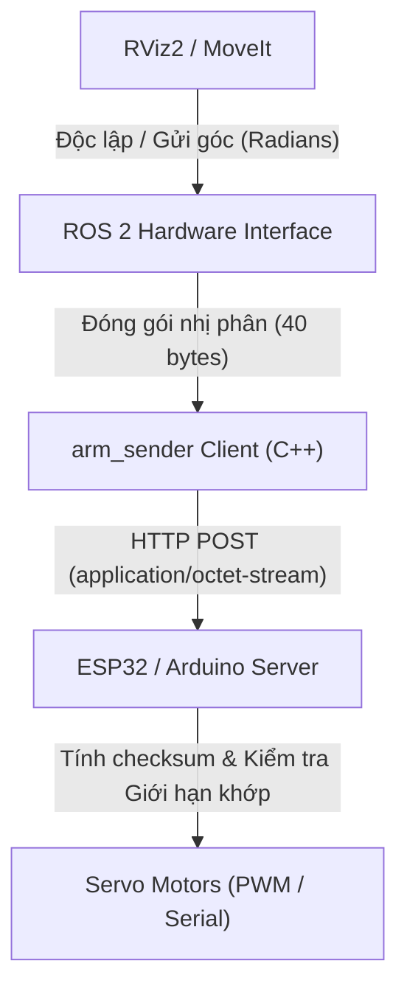

# Hướng dẫn tích hợp: OpenArm Low-Level Control API (7 Joints)

Tài liệu này hướng dẫn cách sử dụng và tích hợp bộ API giao tiếp nhị phân mức thấp (low-level binary API) điều khiển **7 khớp** của cánh tay robot OpenArm. Giao thức này đã loại bỏ phần tay gắp (gripper) để tập trung tối đa cho 7 trục chính của robot.

---

## 1. Sơ đồ Luồng điều khiển



---

## 2. Cấu trúc Giao thức Nhị phân (40 Bytes)

Giao thức này được định nghĩa chi tiết trong file [arm_api_protocol.h](file:///home/hans/universal_bot/Open_arm_a1_ws/src/communication/devices/arm_api/arm_api_protocol.h). Cấu trúc payload nhị phân như sau:

| Byte Offset | Kiểu dữ liệu | Tên trường | Ý nghĩa |
|---|---|---|---|
| **0 - 3** | `int32_t` | `command_id` | Mã lệnh điều khiển: `0` = STOP, `1` = SET_JOINTS, `9` = REBOOT |
| **4 - 7** | `int32_t` | `speed_limit` | Giới hạn tốc độ lớn nhất (`1` đến `100` %) |
| **8 - 35** | `float[7]` | `joint_targets` | Mảng chứa góc đích của 7 khớp (đơn vị: **Radians**) |
| **36 - 39** | `int32_t` | `checksum` | Kết quả XOR của 9 biến `int32_t` phía trước để phát hiện lỗi đường truyền |

---

## 3. Quy ước Góc và Giới hạn Khớp (REP-103)

| Khớp (Joint) | Hướng quay dương (+) | Giới hạn tối thiểu (rad) | Giới hạn tối đa (rad) | Giới hạn tối thiểu (Độ) | Giới hạn tối đa (Độ) |
|---|---|---|---|---|---|
| **Joint 1** | Xoay trái (Yaw) | `-1.57` | `+1.57` | `-90°` | `+90°` |
| **Joint 2** | Gập lên (Pitch) | `-1.57` | `+1.57` | `-90°` | `+90°` |
| **Joint 3** | Gập khuỷu (Pitch) | `-2.00` | `+2.00` | `-114.6°` | `+114.6°` |
| **Joint 4** | Gập cổ tay 1 | `-1.57` | `+1.57` | `-90°` | `+90°` |
| **Joint 5** | Gập cổ tay 2 | `-1.57` | `+1.57` | `-90°` | `+90°` |
| **Joint 6** | Xoay cổ tay (Roll) | `-3.14` | `+3.14` | `-180°` | `+180°` |
| **Joint 7** | Xoay mặt bích đầu cuối | `-3.14` | `+3.14` | `-180°` | `+180°` |

> [!WARNING]
> Vi điều khiển bắt buộc phải kiểm tra giới hạn mềm (clamp) để tránh việc lệch trục cơ học hoặc kẹt động cơ khi góc truyền vượt quá giới hạn.

---

## 4. Hướng dẫn Tích hợp Phía Vi điều khiển (ESP32 - Arduino Sketch)

Dưới đây là đoạn code Arduino/ESP32 mẫu hướng dẫn đồng đội của bạn viết server HTTP để lắng nghe dữ liệu nhị phân thô, parse và điều khiển các motor servo PWM:

```cpp
#include <WiFi.h>
#include <WebServer.h>
#include <ESP32Servo.h> // Sử dụng thư viện ESP32Servo để điều khiển PWM servos

// Nạp các struct giao thức chung
#include "arm_api_protocol.h"

// Cấu hình mạng WiFi
const char* ssid = "YOUR_WIFI_SSID";
const char* password = "YOUR_WIFI_PASSWORD";
WebServer server(80);

// Khai báo mảng 7 servo
Servo servos[7];
const int SERVO_PINS[7] = {26, 27, 14, 12, 13, 15, 2}; // Đổi chân GPIO tương ứng của bạn

// Giới hạn xung PWM tương ứng cho servo (500us tương ứng -90 độ, 2500us tương ứng 90 độ)
const int PWM_MIN = 500;
const int PWM_MAX = 2500;

// Tính toán mã checksum XOR
int32_t get_checksum(const ArmApiPayload* payload) {
    const int32_t* raw = (const int32_t*)payload;
    int32_t sum = 0;
    for (int i = 0; i < 9; i++) {
        sum ^= raw[i];
    }
    return sum;
}

// Xử lý gói tin POST nhận được tại /api/arm/command
void handle_arm_command() {
    if (server.method() != HTTP_POST) {
        server.send(405, "text/plain", "Method Not Allowed");
        return;
    }

    String body = server.arg("plain");
    if (body.length() < sizeof(ArmApiPayload)) {
        server.send(400, "text/plain", "Payload size incorrect");
        return;
    }

    // 1. Ép kiểu dữ liệu nhị phân nhận được vào struct
    ArmApiPayload payload;
    memcpy(&payload, body.c_str(), sizeof(ArmApiPayload));

    // 2. Kiểm tra lỗi truyền dữ liệu qua Checksum
    if (payload.checksum != get_checksum(&payload)) {
        server.send(400, "text/plain", "Bad Checksum");
        return;
    }

    // 3. Thực thi lệnh
    if (payload.command_id == CMD_STOP) {
        // Tắt xung PWM điều khiển hoặc xả torque của servo để bảo vệ cơ khí
        for (int i = 0; i < 7; i++) {
            servos[i].detach();
        }
        Serial.println("[MCU] Da xả torque động cơ!");
    } 
    else if (payload.command_id == CMD_SET_JOINTS) {
        for (int i = 0; i < 7; i++) {
            float rad_val = payload.joint_targets[i];
            
            // Đảm bảo chân servo vẫn được kết nối
            if (!servos[i].attached()) {
                servos[i].attach(SERVO_PINS[i], PWM_MIN, PWM_MAX);
            }

            // Quy đổi: Radians -> Degrees
            float deg_val = rad_val * (180.0f / PI);
            
            // Map góc quét của Servo (Ví dụ góc mong muốn từ -90 tới +90 độ tương ứng góc 0-180 của thư viện Servo)
            float servo_pos = deg_val + 90.0f; // Căn lề giữa là 90 độ
            servo_pos = constrain(servo_pos, 0.0f, 180.0f); // Giới hạn an toàn

            servos[i].write(servo_pos);
        }
        Serial.println("[MCU] Da cap nhat góc cho 7 khop!");
    }
    else if (payload.command_id == CMD_REBOOT) {
        server.send(200, "text/plain", "Rebooting");
        delay(500);
        ESP.restart();
        return;
    }

    // 4. Trả về phản hồi nhị phân trạng thái (Feedback) của Robot cho PC
    ArmFeedbackPayload feedback;
    feedback.status = 0; // Hoạt động bình thường
    feedback.is_healthy = 1;
    for (int i = 0; i < 7; i++) {
        // Phản hồi lại góc thực tế (có thể lấy từ cảm biến hoặc góc đã ghi cuối cùng)
        float deg_pos = servos[i].read() - 90.0f;
        feedback.joint_states[i] = deg_pos * (PI / 180.0f);
    }

    // Gửi payload nhị phân phản hồi (36 bytes)
    server.sendContent((const char*)&feedback, sizeof(feedback));
}

void setup() {
    Serial.begin(115200);
    
    // Kết nối WiFi
    WiFi.begin(ssid, password);
    while (WiFi.status() != WL_CONNECTED) {
        delay(500);
        Serial.print(".");
    }
    Serial.println("\nWiFi OK!");

    // Đăng ký cổng API lắng nghe
    server.on("/api/arm/command", HTTP_POST, handle_arm_command);
    server.begin();
}

void loop() {
    server.handleClient();
}
```

---

## 5. Hướng dẫn Biên dịch và Chạy Thử trên PC (Client Side)

Để thực thi gửi câu lệnh từ PC bằng C++, định nghĩa flag `CLIENT_SIDE_REQUIRED` khi biên dịch file `arm_api.cpp` đi kèm với thư viện `libcurl`.

### Biên dịch qua Terminal:
```bash
g++ -DCLIENT_SIDE_REQUIRED arm_api.cpp -o arm_sender -lcurl
```

### Sử dụng câu lệnh gửi test trong C++:
```cpp
#include "arm_api_protocol.h"
// Khai báo góc đích cho 7 khớp (đơn vị Radians)
float target_angles[7] = {0.0f, 0.2f, -0.5f, 0.0f, 1.2f, -0.3f, 0.0f};

ArmFeedbackPayload robot_state;
OpenArmApiClient client("http://192.168.1.100:80/api/arm/command");

if (client.sendJointsCommand(target_angles, 50, robot_state)) {
    std::cout << "Gui lenh thanh cong! Goc khop thuc te tra ve tu robot: " << std::endl;
    for(int i = 0; i < 7; ++i) {
        std::cout << "Joint " << (i+1) << ": " << robot_state.joint_states[i] << " rad" << std::endl;
    }
} else {
    std::cerr << "Gui lenh that bai!" << std::endl;
}
```
